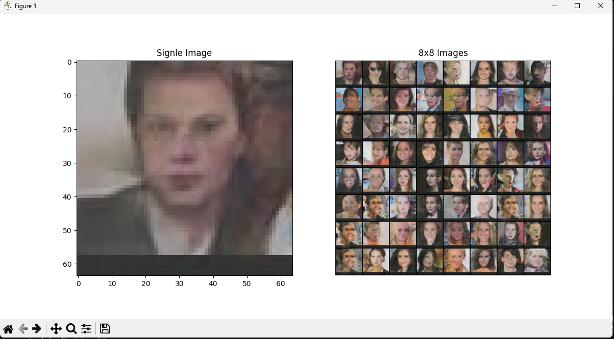

# DCGAN网络实现人脸生成

### 结果展示

> 训练100个epoch的效果，基本上几十个epoch之后，损失就固定了，不会进一步的减小。所以要想生成更好更清晰的人脸图像，就需要对网络进行进一步的改进。

### 数据集

CelebA数据集

[下载链接](https://mmlab.ie.cuhk.edu.hk/projects/CelebA.html)

### 预处理

训练中，Dataloader读取数据集时会对图片进行一些预处理操作，这些操作通常在 CPU 上执行，而不是 GPU 上。由于数据集较大（20w张图片），所以会耗费大量时间，GPU 在等待数据时会处于空闲状态，导致 GPU 使用率低，浪费了显卡资源。

所以在下载完数据集中，事先将耗时较大的resize操作完成。使用 `img_resize_to_64x64.py`提前将数据集裁剪为64x64大小的图片保存到新文件夹中。然后训练时只需要将图片转化为`Tensor`，这样Dataloader读取数据集会快很多，加快训练速度。
然后还在Dataloader中使用了多线程并行加载数据，同时拉高batch_size。总体来说加快了不少训练速度。
> 对于这种大型数据集，如何加快训练速度，避免CPU瓶颈的现象本人研究的不多，后面如果了解到更好的方法会回来尝试一下。
> 后续可能会研究一下DALI，将整个预处理操作都转移到GPU上完成

### 训练和测试

`dcgan_me.py`

将最下方的 `TRAIN `标志位置1进行训练，`TEST `标志位置1测试效果。

> 具体训练相关的超参数在 `train()`函数中调整
